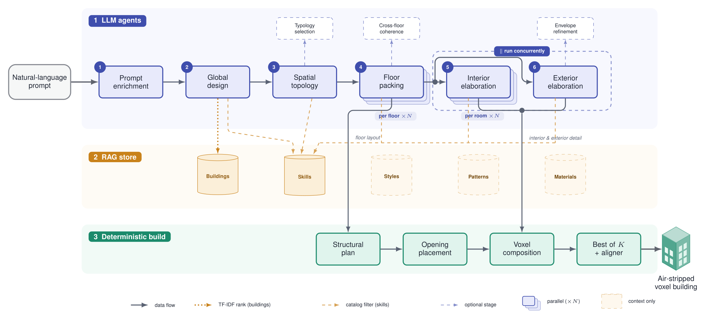

# HomeCraft — Text-to-Voxel Building Generation with LLM Agents

HomeCraft is the implementation of a UPC/FIB final-degree project (TFG) that turns a
**natural-language prompt into a complete Minecraft building** — coherent exterior *and*
functional, furnished interior — for Minecraft Java Edition **1.16.5**.

Most prior systems generate *either* a building shell (mass, roof, façade) *or* the rooms
inside a given floor plan. HomeCraft coordinates **both** from a single text prompt by
combining an **LLM-agent cascade**, a **five-collection retrieval store (RAG)**, an
**executable skill library** that compiles high-level design ops into voxels, and a
**geometry-based evaluator** grounded in Christopher Alexander's *A Pattern Language*.

The pipeline (the *cascade*) reads left to right through three bands: **LLM decision agents** make
the architectural choices, grounded by the **five-collection RAG store**, and a fixed
**deterministic back end** turns those decisions into blocks.



*A single natural-language prompt (far left) becomes an air-stripped voxel building (far right).
**Band 1 (LLM agents):** six agents refine the design in order — prompt enrichment → global design
→ spatial topology → floor packing (`×N`) → interior & exterior elaboration (running concurrently);
three optional refinements are dashed. **Band 2 (RAG store):** reference buildings are TF-IDF
*ranked* and skills *filtered*; styles, patterns and materials are context only. **Band 3
(deterministic build):** structural plan → opening placement → voxel composition → best-of-K +
aligner. Full walkthrough in [`pipeline_description.md`](pipeline_description.md).*

---

## Repository layout

This repo mirrors the architecture described in the dissertation. Each concept maps to a folder:

| Concept | Location |
|---|---|
| Cascade pipeline (Chapter 4) | [`pipeline/agents/`](pipeline/agents/) |
| Executable skill library | [`pipeline/skills/`](pipeline/skills/) |
| Prompt templates per cascade stage | [`pipeline/agents/prompts/`](pipeline/agents/prompts/) |
| Retrieval store schemas | [`rag/schema/`](rag/schema/) |
| Skill metadata | [`rag/skills/`](rag/skills/) |
| Style packs | [`rag/styles/`](rag/styles/) |
| Alexander patterns | [`rag/patterns/`](rag/patterns/) |
| Material catalogue | [`rag/materials/`](rag/materials/) |
| Reference building corpus | [`rag/reference_buildings/`](rag/reference_buildings/) |
| Corpus provenance & license audit | [`rag/PROVENANCE_AUDIT.md`](rag/PROVENANCE_AUDIT.md) |
| Evaluator (Chapter 5) | [`pipeline/agents/evaluator.py`](pipeline/agents/evaluator.py) |
| Iterative skill curation loop | [`tools/gym/`](tools/gym/) |
| Cross-model experiment harness | [`scratch/experimento/`](scratch/experimento/) + [`tools/run_experiment2.py`](tools/run_experiment2.py) |
| Cross-reference verifier | [`tools/verify_rag_cross_refs.py`](tools/verify_rag_cross_refs.py) |
| Browser viewer | [`viewer/`](viewer/) |
| Plot generation | [`tools/build_plots.py`](tools/build_plots.py) |

> **Note on the reference corpus.** The full corpus is ~2,700 buildings of mixed
> provenance (mostly research/non-commercial licenses). To keep this repo lightweight and
> redistributable, only the **61 MIT-licensed buildings** are shipped here as a working
> sample — enough to run the viewer, retrieval, and corpus tooling end-to-end. See
> [`rag/reference_buildings/README.md`](rag/reference_buildings/README.md).

---

## Quick start

### 1. Install dependencies

```bash
python3 -m venv .venv && source .venv/bin/activate
pip install -r requirements.txt          # pipeline runtime
pip install -r tools/requirements.txt     # corpus tooling (ingest, analysis) — optional
```

Python 3.10+ is required.

### 2. Generate a building from a prompt

The pipeline calls LLMs through [OpenRouter](https://openrouter.ai/keys), so set your key:

```bash
export OPENROUTER_API_KEY=sk-or-v1-...
python3 -m pipeline.agents.run "a cozy medieval cottage with a kitchen and two bedrooms"
```

The result is written as a voxel-building JSON (palette + `[x, y, z, palette_idx]` voxels)
that the viewer can open directly. Useful environment overrides:

| Variable | Purpose | Default |
|---|---|---|
| `OPENROUTER_API_KEY` | LLM access (required) | — |
| `MODEL_MAIN` / `MODEL_WORKER` | per-stage model override | `google/gemini-2.5-flash-lite` |
| `LLM_BASE_URL` | point to a self-hosted OpenAI-compatible endpoint | OpenRouter |

### 3. Explore buildings in the browser viewer

```bash
python3 -m http.server 8000
# open http://localhost:8000/viewer/
```

A Three.js viewer that renders the reference corpus and any generated building. Keybinds and
limitations are documented in [`viewer/README.md`](viewer/README.md).

### 4. Preview a single skill

```python
from pipeline.skills.preview import export_skill
export_skill("kitchen", style="medieval", size="small")   # → openable in the viewer
```

---

## How it works

### LLM-agent cascade — `pipeline/agents/`

Six core LLM agents (via `llm.py` / OpenRouter) make the design decisions; four deterministic
Python stages turn them into blocks. The agents speak in **shape operations** — declarative
instructions like *"lay an oak-plank floor over this rectangle"*.

**Decision agents:**
1. **Prompt enrichment** — expands the prompt into a full brief (style, size, category, room roles).
2. **Global design** — fixes the silhouette, bounding box, floor stack and roof style.
3. **Spatial topology** — lays out the per-floor layout templates and room-adjacency graph.
4. **Per-floor packing** (one call per floor, parallel) — places the rooms on each floor.
5. **Interior elaboration** (one call per room, parallel) — furnishes and decorates each room.
6. **Exterior elaboration** — gardens, walls, water features and other site features.

**Deterministic builders:** *structural plan* (walls/floors/roof) → *opening placement*
(doors/windows/stairs, with passability repairs) → *voxel composition* (merge all shape ops into
a voxel map, later-wins, air-stripped) → *best-of-K* (keep the highest-scoring of K seeds) →
*alignment verdict* (remove floating blocks). Three optional refinement agents (typology selector,
cross-floor coherence, envelope refinement) may be inserted.

Each stage's system prompt lives in [`pipeline/agents/prompts/`](pipeline/agents/prompts/). Full
walkthrough with the composition algorithm: [`pipeline_description.md`](pipeline_description.md).

### Executable skill library — `pipeline/skills/`

A skill is a Python module exposing `build(aabb, materials, style, **kwargs) -> list[Op]`.
`Op`s are a small AST (fill, outline, columns, stairs, roofs, …) defined in `base.py`.
`composer.py` materialises ops to voxels with **"later-wins" dedupe** and air-stripping
(no `minecraft:air` is ever stored — an ~88 % space saving used project-wide). Materials are
deferred via role placeholders (`@primary`, `@glass`, `@roof`, …) resolved per style at compose
time. Coordinate convention: `x = width`, `y = height (up)`, `z = depth`; AABBs are half-open.

Each skill module is paired 1:1 with a searchable JSON entry in `rag/skills/`.

### Five-collection RAG — `rag/`

| Code | Collection | Count | Role |
|---|---|---|---|
| A | `skills/` | 316 | parametric building procedures (paired with `pipeline/skills/`) |
| B | `styles/` | 10 | palettes, signature blocks and ratios per style |
| C | `patterns/` | 29 | Alexander patterns with verified citations |
| D | `materials/` | 182 | Minecraft 1.16.5 block catalogue |
| E | `reference_buildings/` | sample of 61 (MIT) | real buildings as voxel arrays |

Reference buildings (**E**) are **ranked** by TF-IDF similarity; skills (**A**) are **filtered** as
a typed catalogue — both share `tags.category` / `tags.style`, so the two searches agree. **B**
(styles) and **C** (patterns) are read as prompt context; **D** (materials) is used offline only.
The data provenance — verified against primary sources vs. synthesised — is documented in
[`rag/PROVENANCE_AUDIT.md`](rag/PROVENANCE_AUDIT.md) and [`rag/README.md`](rag/README.md).

### Evaluator — `pipeline/agents/evaluator.py`

A **metric battery** of 18 deterministic geometric checks (no LLM judge) across five families,
combined into one composite score:

```
S(B) = 0.30·prompt adherence + 0.20·physical + 0.20·interior + 0.15·Alexander + 0.15·exterior
```

Prompt adherence (did it deliver what was asked) weighs most; physical (does it stand, is it
navigable) and interior (liveable, lit, well-proportioned rooms) follow; the **Alexander** family
operationalises nine of Christopher Alexander's patterns as voxel predicates (intimacy gradient,
light on two sides, main entrance, sheltering roof, window place, …). See
[`pipeline_description.md`](pipeline_description.md) for the full breakdown.

### Skill curation loop — `tools/gym/`

An iterative "gym" that repeatedly builds a diverse prompt set, evaluates it, diagnoses which
skill category is weakest, and reports an action checklist — used to harden the skill library.

---

## Validation tooling

```bash
python3 tools/verify_rag_cross_refs.py        # 6 cross-collection checks (exits 0 iff all pass)
python3 tools/validate_building.py rag/reference_buildings/processed/*.json
python3 -m pipeline.skills.test_harness        # exercise skills across styles & sizes
python3 -m pytest tests/                        # unit tests for planners, connectors, evaluator
```

The cross-reference verifier enforces six invariants: skill→pattern, style→pattern,
skill/style→material, building→material, skill→skill, and JSON-schema validity. It must report
**6/6** before changes ship.

### Corpus & experiment tooling — `tools/`

- **Ingest** (`ingest_*.py`, `common.py`) — convert upstream sources (3D-Craft, HuggingFace
  datasets, `.nbt`, `.schem`/`.litematic`) into canonical building JSONs.
- **Corpus analysis** — `audit_dataset.py`, `build_material_corpus.py`,
  `build_style_palettes.py`, `build_viewer_index.py`.
- **Scoring & retrieval** — `score_corpus.py`, `build_retrieval_index.py`,
  `evaluate_building.py`.
- **Experiments & plots** — `run_experiment2.py` (cross-model comparison),
  `run_integration_loop.py`, `build_plots.py`. Experiment design lives in
  [`scratch/experimento/DISENO.md`](scratch/experimento/DISENO.md).

---

## Documentation

- [`pipeline_description.md`](pipeline_description.md) — detailed pipeline walkthrough (the cascade, stage by stage, with the composition algorithm).
- [`rag/README.md`](rag/README.md) — knowledge-base design and retrieval contract *(en español)*.
- [`docs/TYPOLOGY_CATALOG.md`](docs/TYPOLOGY_CATALOG.md) — architectural typology system.
- [`docs/experimento_comparacion_llms.md`](docs/experimento_comparacion_llms.md) — cross-model experiment design.

---

## Licensing

The **code** in this repository is released under the MIT License (see [`LICENSE`](LICENSE)).

The shipped **reference buildings** (`rag/reference_buildings/processed/`) are the subset of the
corpus carrying an **MIT license**; each building JSON records its `source`, `source_url` and
`license`. The remainder of the original corpus (mostly CC-BY-NC / research-only) is **not**
redistributed here — see [`rag/PROVENANCE_AUDIT.md`](rag/PROVENANCE_AUDIT.md). Minecraft is a
trademark of Mojang/Microsoft; this project is unaffiliated and non-commercial.

---

## Author

**Zhiqian Zhou** — BSc in Artificial Intelligence, UPC / FIB.
Supervisor: Ramon Sangüesa Solé.
