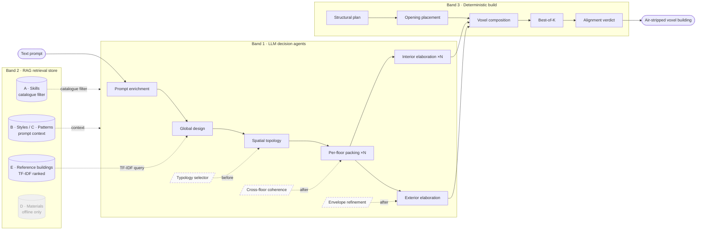

# The HomeCraft pipeline (the *cascade*)

This document explains, end to end, how HomeCraft turns **one natural-language prompt into a
placed voxel building**. It follows the architecture exactly as described in the dissertation
(Chapter 4, *The cascade*) and maps each stage to the code that implements it.

The work is organised into **three tracks**, by who is responsible for each decision:

1. **LLM decision agents** — six core language-model agents (plus three optional refiners) that
   make the *architectural* choices: style, category, silhouette, floor stack, room roles and
   palette. They leave the low-level geometry to the builders.
2. **Retrieval store (RAG)** — five catalogues that ground those decisions in pre-verified
   examples, so the model never has to invent a block, a palette or a design pattern.
3. **Deterministic builders** — four LLM-free stages that turn the decisions into blocks: raise
   the shell, cut the openings, compose the shape operations into a voxel map, and keep the best
   of several voxelisations.

Nine decision agents (six core + three optional) feed four deterministic build stages.



*Read left to right. Floor packing runs once per floor and interior elaboration once per room
(`×N`); the floor layout then forks to interior and exterior elaboration, which run concurrently
before rejoining at voxel composition. The three dashed agents are optional refinements. In the
RAG band, reference buildings are **ranked** (TF-IDF) while skills are **filtered**; styles and
patterns are read as prompt context, and the materials catalogue is used only by offline tooling
(faded).*

> **Which pipeline version?** The full cascade described here is the **v4** pipeline — run it with
> `python3 -m pipeline.agents.run -V v4 "<prompt>"`. A simpler single-designer legacy path
> (`v2.6`) is kept as the default for quick runs.

---

## Band 2 — the retrieval store

The store has five collections, each with a typed schema; a cross-reference verifier
(`tools/verify_rag_cross_refs.py`) checks that every cross-collection identifier resolves.

| Code | Collection | Size | Content | How it is reached |
|---|---|---|---|---|
| A | Skills | 316 | metadata for parameterised builders | **filtered** catalogue lookup |
| B | Style packs | 10 | palettes, ratios, pattern references | prompt context |
| C | Patterns | 29 | Christopher Alexander patterns + citations | prompt context |
| D | Materials | 182 | Minecraft 1.16.5 block IDs + tags | offline only |
| E | Reference buildings | 2,746* | air-stripped voxel buildings | **ranked** by TF-IDF |

\* The full corpus; this public repo ships a 61-building MIT-licensed sample (see
`rag/reference_buildings/README.md`).

- **Reference buildings (E)** are searched with **TF-IDF** — a classical sparse method, well
  suited to a few-thousand-document corpus with no need for an embedding model. Each building was
  first captioned by an LLM into a short description; that text plus its style/category/size tags
  is the document matched against the prompt, restricted to the **top 30 %** of the corpus by the
  evaluator's composite quality score. *(See `pipeline/agents/retriever.py`,
  `tools/build_retrieval_index.py`.)*
- **Skills (A)** are not ranked but **filtered**: a query narrows the catalogue to one *drawer*
  (e.g. floor layouts, or furniture for a given room role), then orders entries by shared-word
  count plus a strong same-category bonus. Because buildings and skills share the same vocabulary
  of styles and categories, the two searches agree — a *medieval residential* prompt returns a
  medieval residential exemplar together with the builders that suit it.
- **Styles (B)** and **Patterns (C)** are loaded once per build and injected into the design
  agents' system prompts as context.
- **Materials (D)** is consumed only offline (corpus tooling, verifier); concrete block IDs at
  generation time come from in-code style palettes.

---

## Band 1 — the LLM decision agents

The agents express their choices as **shape operations**: compact, declarative instructions such
as *"lay an oak-plank floor over this rectangle"* or *"place a bed against this wall"*, which the
deterministic builders later turn into blocks. Every call is constrained by a JSON schema.

| Stage | Module | What it decides |
|---|---|---|
| **Prompt enrichment** | `prompt_expander.py` | Expands the prompt into an 80–200-word brief plus a structured side-car (style guess, size bucket, category, Alexander keywords). Room roles are filled by a deterministic parse of the prompt, not the model. |
| **Global design** | `global_designer.py` | Commits the outer skeleton: a *silhouette* (footprint archetype seen from above — rectangle, L, cross, octagon, round…), an axis-aligned bounding box, a per-floor height list, and a roof style. A deterministic post-pass enforces geometric sanity. |
| **Spatial topology** | `space_planner.py` | Chooses one floor-layout template per floor and one connector template per vertical connection, picks ground-floor entry points, and writes soft room-role hints per floor. It does **not** pack rooms — that is the next stage. |
| **Per-floor packing** | `floor_planner.py` (`×N`, parallel) | One call per floor materialises the floor's rooms as boxes with roles and an adjacency graph. On persistent failure it falls back to a deterministic binary space partition. A validator (`inter_floor_validator.py`) then enforces staircase-shaft alignment and unique room IDs. |
| **Interior elaboration** | `room_agent.py` (`×N`, parallel) | One call per room emits shape operations — skill-library calls with parameters plus ad-hoc placements for personalisation. |
| **Exterior elaboration** | `exterior_agent.py` | A deterministic feature selection biased by category and style (castles → towers + moat; temples → fountain + garden; residentials → hedge + path) is refined by an LLM call that emits exterior shape operations. |

### Optional refinement agents (dashed in the diagram)

Each degrades *silently* to the deterministic baseline if its call fails:

- **Typology selector** (`typology_chooser.py` → `typology_injector.py`), before *spatial
  topology* — picks one typology per family (silhouette, roof, tower, window, garden) so
  downstream agents can refer to them by identifier.
- **Cross-floor coherence** (`coherence_agent.py`), after *per-floor packing* — emits small
  two-cell nudges when a staircase shaft or wall does not line up between storeys.
- **Envelope refinement** (`envelope_decorator.py`), after *exterior elaboration* — targets the
  four metrics the evaluator historically scores worst (sheltering roof, light on two sides,
  building edge, light coverage).

---

## Band 3 — the deterministic builders

| Stage | Module | What it does |
|---|---|---|
| **Structural plan** | `architecture_planner.py` (+ `footprint.py`, `massing.py`, `roofs.py`) | Turns the floor plans and global intent into structural voxels: per-room walls and slabs, per-floor covering slabs, and the chosen roof. The roof is dispatched to one of ~20 roof archetypes (gable, hip, dome, spire, pagoda…) with modular snap-on pieces. |
| **Opening placement** | `connector_planner_v4.py` + `connector_validator.py` | Places doors, windows and staircases. A validator runs six deterministic repairs per connector to guarantee *passability* (an occupant can actually walk through) and keeps staircases inside circulation rooms. |
| **Voxel composition** | `pipeline/skills/composer.py` (via `voxelizer.py`, `aggregator.py`) | Where shape operations become blocks (algorithm below). |
| **Best-of-K** | inside the voxelizer | Runs composition `K` times (typically 3) with different random seeds, scores each under the composite metric, and keeps the highest. No extra LLM call — it exploits the small randomness in the parametric builders and typology layer. |
| **Alignment verdict** | `aligner.py` | A 26-connectivity component pass removes blocks floating free of the ground (the classic floating-block bug); the LLM is then asked for a short, *report-only* coherence verdict recorded in the evaluation. |

### Voxel composition algorithm

Two nested routines turn the accumulated operation list into the final block grid:

```
Compose(ops, materials):
    V ← {}                                  # voxel map indexed by (x, y, z)
    for op in ops:                          # in order
        for (x, y, z, block) in op.Compile(materials):
            if block is an air variant:
                remove (x, y, z) from V      # carve, e.g. a doorway
            else:
                V[(x, y, z)] ← block         # later writes win
    translate V to origin; build palette; return (voxels, palette, size, origin)
```

- **`Compile`** expands one operation, with the material palette, into explicit
  `(x, y, z, block)` tuples — resolving placeholders such as `@bed` or `@stairs[facing=east]` into
  concrete Minecraft 1.16.5 block IDs.
- **Later writes win**, so detail layered on top of structure always takes precedence.
- **Air is dropped**: only solid blocks are stored (the project-wide air-stripped convention,
  ~88 % storage saving).

### A note on the deterministic safety net

The cascade also carries an optional **safety net** (`physical_fixer.py`, `furnish.py`): a repair
pass that fixes head-height clipping, carves a door into any unreachable room, and fills dim
rooms with a lantern grid. It is controlled by one switch (`HOMECRAFT_FALLBACK_MODE`) and is
**off** in the cross-model comparison, so the score reflects the language model rather than
hand-written patches; turning it on gives the deployable view of the system.

---

## The skill library — `pipeline/skills/`

A skill is a Python module exposing `build(aabb, materials, style, **kwargs) -> list[Op]`. `Op`s
are a small AST (`base.py`):

| Op | Meaning |
|---|---|
| `PlaceBlock` | a single voxel |
| `Fill` / `FillHollow` | solid box / hollow shell (walls, floor, ceiling) |
| `Outline` | the edges of a box |
| `Rect` | a filled 2-D rectangle on a chosen plane |
| `Line` | a 3-D Bresenham line |
| `Cylinder` | hollow or solid cylinder |
| `Stairs` | a staircase between two Y levels |

Materials are deferred via **role placeholders** (`@primary`, `@secondary`, `@accent`, `@roof`,
`@floor`, `@glass`, `@light`, …) resolved per style at compose time, so the same skill renders in
any style. Coordinate convention: `x = width`, `y = height (up)`, `z = depth`; AABBs are
half-open. Each skill module is paired 1:1 with a searchable JSON entry in `rag/skills/`.

---

## The evaluator — `pipeline/agents/evaluator.py`

The evaluator is the **metric battery**: 18 metrics across five families, **all deterministic
geometric predicates** over the voxel grid, the room topology, and the planned connectors. There
is no LLM scoring (the alignment verdict is report-only).

| Family | Weight | Metrics |
|---|---|---|
| **Prompt adherence** | **0.30** | generation success, room count, material adherence, floor adherence, furniture adherence |
| **Physical** | 0.20 | structural integrity, voxel connectivity, volume density, block legitimacy |
| **Interior** | 0.20 | space utilisation, room size, room furnishing, vertical clearance, light coverage, material consistency, door functionality |
| **Alexander** | 0.15 | intimacy gradient, light on two sides, main entrance, entrance transition, common areas at the heart, farmhouse kitchen, sheltering roof, window place, building edge, roof layout |
| **Exterior** | 0.15 | envelope integrity |

Each family score is a weighted mean of its *defined* metrics (preconditions absent → metric
skipped, weights renormalised). The overall composite is:

```
S(B) = 0.30·prompt + 0.20·physical + 0.20·interior + 0.15·Alexander + 0.15·exterior
```

Prompt carries the highest weight (the system must first deliver what the user asked for);
physical and interior follow as necessary conditions; Alexander and exterior are refinements. A
few metrics (block legitimacy, material consistency, door functionality) act as validity gates
and are reported but excluded from the composite.

The nine Alexander metrics operationalise building/room/threshold-scale patterns as voxel
predicates — e.g. **intimacy gradient** (private rooms deeper from the entry than public ones,
via rank correlation), **light on two sides** (rooms with windows on multiple exterior walls),
**main entrance** (a legible, marked front door), **sheltering roof** (a real pitched roof rising
above the walls), **window place** (windows with seating within reach).

---

## Running it

```bash
export OPENROUTER_API_KEY=sk-or-v1-...
python3 -m pipeline.agents.run -V v4 "a cozy medieval cottage with a kitchen and two bedrooms"
```

Useful environment variables:

| Variable | Purpose | Default |
|---|---|---|
| `OPENROUTER_API_KEY` | LLM access (required) | — |
| `MODEL_MAIN` / `MODEL_WORKER` | per-stage model override | `google/gemini-2.5-flash-lite` |
| `LLM_BASE_URL` | self-hosted OpenAI-compatible endpoint | OpenRouter |
| `HOMECRAFT_FALLBACK_MODE` | enable the deterministic safety net | off |
| `HOMECRAFT_CATALOG_OFF` | skip the typology catalogue (v4) | off |

The run writes a `ReferenceBuilding` JSON (palette + `[x, y, z, palette_idx]` voxels) plus a
per-stage checkpoint trail, openable directly in the browser viewer (`viewer/`).
